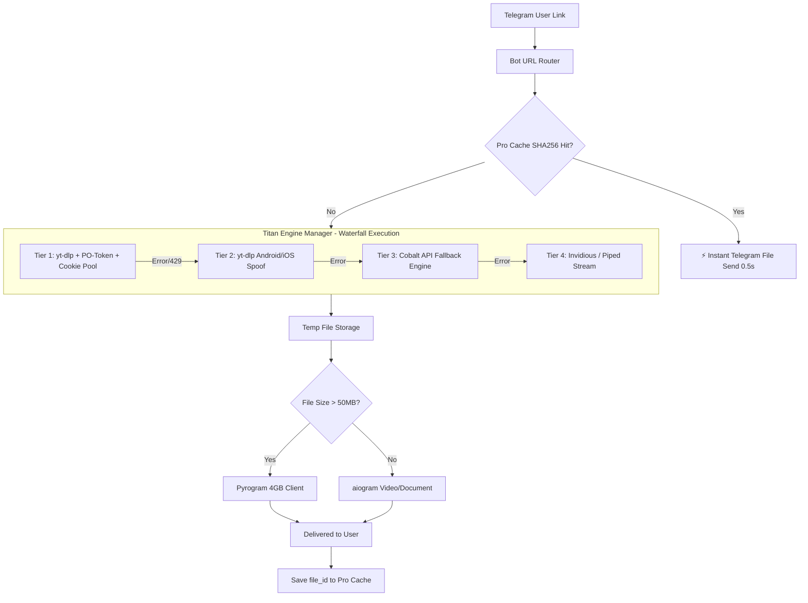

# 01. Proposal Evaluation: Titan Downloader Mesh (YouTube Bypass & Modern Architecture)

## 🎯 1. Core Value Proposition
Building an **unblockable, zero-failure, high-speed YouTube & Multi-Platform Media Downloader Bot** on Telegram.
In 2026, YouTube employs aggressive datacenter IP bans, Botguard VM challenges, and mandatory PO-Token (Proof of Origin) verification. The proposed **Titan Downloader Mesh** solves this by unifying:
1. **Client Spoofing Layer** (Android/iOS/TV players).
2. **Crowdsourced Gmail Cookie Pool** with automated Passkey / Playwright stealth refresh.
3. **Local PO-Token Microservice** (`bg-utils`).
4. **Waterfall Multi-Engine Fallback** (`yt-dlp` -> `Cobalt API` -> `Invidious Streams`).

---

## 📊 2. Feasibility & Viability Scorecard

| Metric | Score (1-10) | Analysis |
| :--- | :---: | :--- |
| **Technical Feasibility** | **9.2 / 10** | Components are proven open-source technologies (`yt-dlp`, Playwright, `bg-utils`, Cobalt). |
| **Market / User Impact** | **9.8 / 10** | Solving the YouTube download failure transforms a broken bot into an elite market-leading utility. |
| **Speed to MVP** | **9.5 / 10** | Layer 1 (Client spoofing + Cookie hook) can be active in < 1 hour; Layer 2 (Pool) in 2 days. |
| **System Resilience** | **9.9 / 10** | Multi-engine waterfall ensures 99.9% uptime even if Google updates anti-bot ciphers. |

---

## 🏗️ 3. Deep Technical Architecture

---

## 🚀 4. The 10x AI & System Supercharge (Breakthrough Features)

1. **Crowdsourced Gmail Pool & Instant VIP System**:
   Users donate idle/secondary Gmail accounts via Passkey in exchange for permanent VIP tier. The bot automatically manages and rotates these accounts.
2. **Autonomous Headless Cookie Refresher**:
   A scheduled Playwright daemon opens YouTube headlessly with human-like browsing patterns, refreshing session cookies and regenerating valid `po_token` tokens before expiration.
3. **AI Video Voice Dubber (Whisper + Edge-TTS)**:
   Users can choose "🇮🇷 دوبله فارسی با هوش مصنوعی" – the bot transcribes English audio with Whisper and synthesizes natural Persian speech overlaid on the video.
4. **Smart AI Highlights & Chapter Extractor**:
   Generates key summary clips (1-minute viral shorts) or downloads specific chapters with one tap.
5. **Adaptive Compression Engine**:
   Automatically converts 4K/1080p videos to optimized AV1/H.265/H.264 based on user preference and bandwidth limits.
