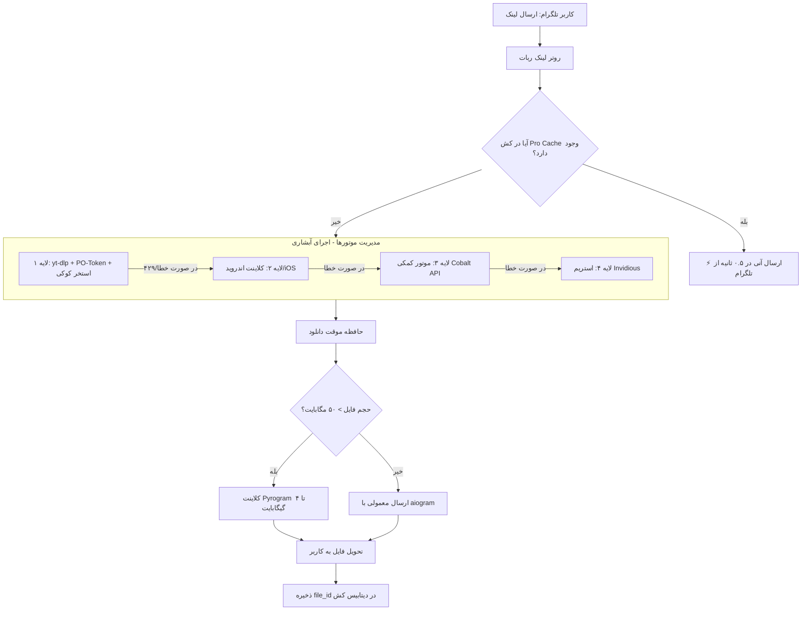

# ۰۱. ارزیابی جامع طرح: شبکه دانلود تیتان (Titan Downloader Mesh)

## 🎯 ۱. هدف و ارزش بنیادین طرح
ساخت یک **ربات دانلودر فوق‌العاده سریع، ضدبلاک و بدون قطعی (Zero-Failure)** در تلگرام برای یوتیوب، اینستاگرام، تیک‌تاک و توییتر.
در سال ۲۰۲۶، یوتیوب با مسدودسازی IP سرورهای دیتاسنتر و اعمال چالش‌های جاوااسکریپتی Botguard و PO-Token، دانلود مستقیم را غیرممکن کرده است. طرح **Titan Downloader Mesh** با ترکیب ۴ لایه هوشمند، این محدودیت‌ها را برای همیشه از بین می‌برد:
۱. **لایه شبیه‌سازی کلاینت‌ها (Client Spoofing):** تغییر هویت به کلاینت‌های اندروید، iOS و تلویزیون هوشمند.
۲. **استخر جیمیل‌های اهدایی کاربران (Crowdsourced Cookie Pool):** لاگین با Passkey و بروزرسانی خودکار کوکی‌ها توسط مرورگر هدلس Playwright.
۳. **میکروسرویس تولید PO-Token محلی (`bg-utils`):** تولید توکن‌های معتبر Botguard در داخل سرور.
۴. **موتور پشتیبان آبشاری (Waterfall Multi-Engine):** سوییچ خودکار به Cobalt API و Invidious در صورت مسدودی موقت.

---

## 📊 ۲. جدول ارزیابی امکان‌سنجی و پتانسیل

| سنجه | امتیاز (۱ تا ۱۰) | تحلیل کارشناسی |
| :--- | :---: | :--- |
| **امکان‌پذیری فنی** | **۹.۲ از ۱۰** | ابزارهای پایه (`yt-dlp`, Playwright, `bg-utils`, Cobalt) همگی متن‌باز و اثبات‌شده هستند. |
| **تأثیرگذاری روی کاربر و بازار** | **۹.۸ از ۱۰** | حل قطعی دانلود یوتیوب، ربات را به یکی از محبوب‌ترین و پرکاربرترین ربات‌های تلگرام تبدیل می‌کند. |
| **سرعت پیاده‌سازی فاز ۱** | **۹.۵ از ۱۰** | فعال‌سازی لایه ۱ (کوکی + کلاینت‌های ضدبلاک) در کمتر از ۱ ساعت قابل اجراست. |
| **پایداری سیستم (Uptime)** | **۹.۹ از ۱۰** | سیستم فال‌بک آبشاری تضمین می‌کند که حتی با آپدیت‌های ناگهانی گوگل، دانلود قطع نشود. |

---

## 🏗️ ۳. معماری فنی سیستم (جریان داده)

---

## 🚀 ۴. قابلیت‌های خارق‌العاده نسل جدید (۱۰x Supercharge)

۱. **سیستم اشتراک مادام‌العمر در ازای اهدای جیمیل (مشابه رستم):**
   کاربران جیمیل‌های بلااستفاده خود را با Passkey اضافه کرده و اشتراک VIP نامحدود دریافت می‌کنند.
۲. **ربات مرورگر خودکار (Playwright Stealth Refresher):**
   یک اسکریپت پس‌زمینه روزانه کوکی‌ها را در مرورگر واقعی بدون دخالت انسان تازه نگه می‌دارد.
۳. **دوبله صوتی هوش مصنوعی فارسی (AI Persian Dubber):**
   تبدیل گفتار انگلیسی ویدیوها به متن با Whisper و تولید صدای فارسی روان با هوش مصنوعی.
۴. **برش هوشمند هایلایت‌ها و بخش‌های ویدیو:**
   امکان برش خودکار شورتز‌های ۱ دقیقه‌ای یا دانلود فصل‌های خاص ویدیو یوتیوب.
۵. **فشرده‌سازی تطبیقی با فرمت‌های AV1 و H.265:**
   کاهش ۶۰ درصدی حجم ویدیو بدون افت کیفیت برای دانلود فوق سریع با اینترنت همراه.
