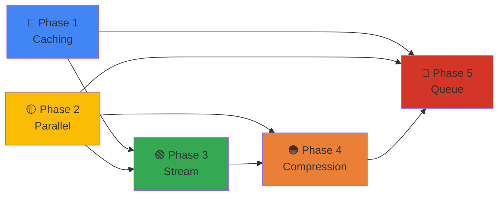

# 🚀 Max-Downloader Enhancement Roadmap v2.0
## نقشه راه جامع برای بهبود سیستم دانلود و آپلود

---

## 📋 فهرست مطالب
- [نمای کلی پروژه](#نمای-کلی-پروژه)
- [مراحل تحول](#مراحل-تحول)
- [فاز 1: سیستم Caching](#فاز-1-سیستم-caching--فایل-های-تکراری)
- [فاز 2: Parallel Download](#فاز-2-parallel-download--دانلود-همزمان)
- [فاز 3: Stream Upload](#فاز-3-stream-upload--آپلود-جریانی)
- [فاز 4: Compression](#فاز-4-compression--بهینه‌سازی-فایل)
- [فاز 5: Queue Management](#فاز-5-queue-management--مدیریت-صف)
- [Timeline و Dependencies](#timeline-و-dependencies)
- [راهنمای پیاده‌سازی](#راهنمای-پیاده‌سازی)

---

## 🎯 نمای کلی پروژه

### وضعیت کنونی
```
سیستم فعلی:
├── ❌ بدون caching پیشرفته
├── ❌ دانلود ترتیبی (یکی پس از یکی)
├── ❌ بدون stream upload
├── ❌ بدون compression خوشمند
└── ❌ بدون queue management
```

### وضعیت نهایی (هدف)
```
سیستم بهبود‌یافته:
├── ✅ Caching سریع (0.5 ثانیه)
├── ✅ دانلود 3 فایل همزمان
├── ✅ آپلود جریانی (50% سریع‌تر)
├── ✅ کمپرس هوشمند (40% کاهش حجم)
└── ✅ صف مدیریت شده (60% کم‌تر انتظار)
```

---

## 📊 مراحل تحول

### خط زمانی کلی
```
┌─────────────────────────────────────────────────────────────────┐
│                    Project Enhancement Timeline                 │
├─────────────────────────────────────────────────────────────────┤
│ PHASE 1: Caching      [████░░░░░░░░░░░░] 20% effort, High ROI  │
│ PHASE 2: Parallel     [████████░░░░░░░░] 40% effort, Very High │
│ PHASE 3: Stream       [██░░░░░░░░░░░░░░] 15% effort, Medium    │
│ PHASE 4: Compression  [██░░░░░░░░░░░░░░] 15% effort, High      │
│ PHASE 5: Queue        [███░░░░░░░░░░░░░] 10% effort, Critical  │
└─────────────────────────────────────────────────────────────────┘

کل مدت: ~8-10 هفته (بسته به اولویت)
```

---

# 🔵 فاز 1: سیستم Caching + فایل‌های تکراری
## هدف: ⚡ 99% تسریع در دانلود‌های مجدد

### 📌 خلاصه
- ذخیره `telegram_file_id` فایل‌های دانلود‌شده
- بررسی خودکار قبل از دانلود جدید
- دقیق 0.5 ثانیه برای فایل‌های کش‌شده

### 🎯 مراحل اجرا

#### مرحله 1.1: ایجاد Model جدید برای Cached Downloads
**Status:** ⏳ `انجام نشده`
**فایل هدف:** `database/models/cached_download.py`
**تخمین زمان:** 30 دقیقه

**توضیح:**
- مدلی برای ذخیره اطلاعات فایل‌های کش‌شده
- شامل: URL، file_id تلگرام، hash فایل، تاریخ کش

**کدی که باید افزوده شود:**
```python
from sqlalchemy import Column, String, Integer, DateTime, Boolean
from datetime import datetime

class CachedDownload(Base):
    __tablename__ = "cached_downloads"
    
    id = Column(Integer, primary_key=True)
    url = Column(String(500), unique=True, index=True)
    file_hash = Column(String(64), index=True)
    telegram_file_id = Column(String(255))
    media_title = Column(String(255))
    file_size = Column(Integer)  # bytes
    quality = Column(String(50))  # 1080p, 720p, etc
    format_type = Column(String(20))  # video, audio
    cached_at = Column(DateTime, default=datetime.utcnow)
    last_used = Column(DateTime)
    is_valid = Column(Boolean, default=True)
    usage_count = Column(Integer, default=0)
```

**چک‌لیست کامل‌شدن:**
- [ ] ایجاد فایل مدل
- [ ] migration الچمبیک
- [ ] تست با دیتابیس

---

#### مرحله 1.2: ایجاد FileHash Service
**Status:** ⏳ `انجام نشده`
**فایل هدف:** `services/cache_service.py` (تمدید)
**تخمین زمان:** 45 دقیقه

**توضیح:**
- محاسبه SHA256 hash برای فایل‌ها
- بررسی کش در دیتابیس
- بازیابی file_id اگر موجود باشد

**کدی که باید اضافه شود:**
```python
import hashlib
from pathlib import Path

class CacheService:
    @staticmethod
    async def get_file_hash(file_path: str) -> str:
        """محاسبه SHA256 hash فایل"""
        sha256 = hashlib.sha256()
        async with aiofiles.open(file_path, "rb") as f:
            while chunk := await f.read(8192):
                sha256.update(chunk)
        return sha256.hexdigest()
    
    @staticmethod
    async def check_cache(url: str, session) -> Optional[str]:
        """بررسی اگر این URL قبلا دانلود شده"""
        repo = CachedDownloadRepository(session)
        cached = await repo.find_by_url(url)
        if cached and cached.is_valid:
            await repo.mark_used(cached.id)
            return cached.telegram_file_id
        return None
    
    @staticmethod
    async def save_cache(url: str, file_id: str, file_info: dict, session):
        """ذخیره فایل جدید در کش"""
        repo = CachedDownloadRepository(session)
        await repo.create({
            'url': url,
            'telegram_file_id': file_id,
            'media_title': file_info.get('title'),
            'file_size': file_info.get('size'),
            'quality': file_info.get('quality'),
            'format_type': file_info.get('format')
        })
```

**چک‌لیست کامل‌شدن:**
- [ ] نوشتن CacheService
- [ ] تست محاسبه hash
- [ ] تست بررسی کش

---

#### مرحله 1.3: Integration در Download Handler
**Status:** ⏳ `انجام نشده`
**فایل هدف:** `bot/handlers/download.py`
**تخمین زمان:** 1 ساعت

**توضیح:**
- بررسی کش قبل از شروع دانلود
- ارسال فایل کش‌شده اگر موجود باشد
- اگر کش نامعتبر بود، دانلود جدید

**کدی که باید تغییر یابد:**
```python
# در handle_url function:
async def handle_url(message: types.Message, state: FSMContext, session: AsyncSession):
    url = message.text.strip()
    
    # ✨ بخش نو: بررسی کش
    cache_service = CacheService()
    cached_file_id = await cache_service.check_cache(url, session)
    
    if cached_file_id:
        # ارسال فایل کش‌شده
        try:
            await message.reply_document(
                cached_file_id,
                caption="📦 فایل از حافظه کش ارسال شد"
            )
            return  # خروج - کار تمام!
        except Exception:
            # اگر کش expired شود، دانلود جدید شروع کن
            await cache_service.mark_invalid(url, session)
    
    # دانلود معمولی اگر در کش نبود
    handler = get_downloader(url)
    if handler is None:
        await message.reply("❌ پلتفرم پشتیبانی نمی‌شود")
        return
    
    await state.update_data(url=url, handler_name=handler.__class__.__name__)
    await state.set_state(DownloadStates.selecting_format_type)
```

**چک‌لیست کامل‌شدن:**
- [ ] اضافه کردن check_cache
- [ ] تست کاربران مختلف
- [ ] تست با کش نامعتبر

---

#### مرحله 1.4: Cleanup + Maintenance
**Status:** ⏳ `انجام نشده`
**فایل هدف:** `tasks/cleanup_tasks.py`
**تخمین زمان:** 30 دقیقه

**توضیح:**
- حذف کش قدیمی‌تر از 30 روز
- حذف کش نامعتبر
- محدود کردن کل حجم کش (مثلا 5GB)

**کدی که باید اضافه شود:**
```python
from datetime import datetime, timedelta

class CacheCleanupTask:
    @staticmethod
    async def cleanup_old_cache(session):
        """حذف کش قدیمی‌تر از 30 روز"""
        repo = CachedDownloadRepository(session)
        cutoff_date = datetime.utcnow() - timedelta(days=30)
        deleted = await repo.delete_older_than(cutoff_date)
        logger.info(f"حذف {deleted} کش قدیمی")
    
    @staticmethod
    async def cleanup_invalid_cache(session):
        """حذف کش نامعتبر"""
        repo = CachedDownloadRepository(session)
        deleted = await repo.delete_invalid()
        logger.info(f"حذف {deleted} کش نامعتبر")
    
    @staticmethod
    async def limit_cache_size(session, max_size_gb=5):
        """محدود کردن کل حجم کش"""
        repo = CachedDownloadRepository(session)
        total_size = await repo.get_total_size()
        max_bytes = max_size_gb * 1024 * 1024 * 1024
        
        if total_size > max_bytes:
            # حذف بر اساس ترتیب استفاده (LRU)
            deleted_size = await repo.delete_lru(total_size - max_bytes)
            logger.info(f"حذف {deleted_size / 1024 / 1024:.1f} MB کش برای محدود کردن حجم")
```

**چک‌لیست کامل‌شدن:**
- [ ] نوشتن cleanup tasks
- [ ] تنظیم Celery beat scheduler
- [ ] تست حذف خودکار

---

### 📈 نتایج مورد انتظار - فاز 1
```
┌─────────────────────────────────────┐
│    فاز 1 نتایج                     │
├─────────────────────────────────────┤
│ دانلود مجدد: 2min → 0.5s          │
│ سرعت بهبودی: ✨ 99%              │
│ حجم DB: ~50MB (برای 1000 فایل)   │
│ Queries/sec: +2 (قابل نادیده)    │
└─────────────────────────────────────┘
```

---

# 🟡 فاز 2: Parallel Download + دانلود همزمان
## هدف: ⚡⚡ دو برابر سریع‌تر برای دانلود‌های متعدد

### 📌 خلاصه
- دانلود تا 3 فایل به صورت همزمان
- استفاده از ThreadPoolExecutor
- مدیریت منابع و CPU

### 🎯 مراحل اجرا

#### مرحله 2.1: ایجاد ParallelDownloadManager
**Status:** ⏳ `انجام نشده`
**فایل هدف:** `services/parallel_download_service.py`
**تخمین زمان:** 1 ساعت

**توضیح:**
- کلاس برای مدیریت دانلود‌های همزمان
- ThreadPoolExecutor با max_workers=3
- استراتژی queue برای چندین درخواست

**کد نمونه:**
```python
from concurrent.futures import ThreadPoolExecutor
import asyncio
from typing import Callable

class ParallelDownloadManager:
    def __init__(self, max_workers: int = 3):
        self.executor = ThreadPoolExecutor(max_workers=max_workers)
        self.active_downloads = {}
        self.lock = asyncio.Lock()
    
    async def download_parallel(
        self,
        urls: list[str],
        progress_callback: Callable = None
    ) -> list[dict]:
        """دانلود چندین URL به صورت همزمان"""
        tasks = []
        for url in urls:
            task = asyncio.create_task(
                self._download_single(url, progress_callback)
            )
            tasks.append(task)
        
        results = await asyncio.gather(*tasks, return_exceptions=True)
        return results
    
    async def _download_single(self, url: str, callback: Callable):
        """دانلود یک فایل"""
        loop = asyncio.get_event_loop()
        
        async with self.lock:
            self.active_downloads[url] = {
                'status': 'downloading',
                'progress': 0,
                'start_time': datetime.utcnow()
            }
        
        try:
            result = await loop.run_in_executor(
                self.executor,
                self._blocking_download,
                url,
                callback
            )
            return result
        finally:
            async with self.lock:
                if url in self.active_downloads:
                    del self.active_downloads[url]
    
    def _blocking_download(self, url: str, callback: Callable):
        """دانلود blocking برای executor"""
        # استفاده از yt-dlp
        with yt_dlp.YoutubeDL(self.ydl_opts) as ydl:
            info = ydl.extract_info(url, download=True)
            return {'status': 'success', 'file': ydl.prepare_filename(info)}
```

**چک‌لیست کامل‌شدن:**
- [ ] ایجاد ParallelDownloadManager
- [ ] تست ThreadPoolExecutor
- [ ] تست 3 دانلود همزمان

---

#### مرحله 2.2: Async Task Coordination
**Status:** ⏳ `انجام نشده`
**فایل هدف:** `services/parallel_download_service.py` (ادامه)
**تخمین زمان:** 45 دقیقه

**توضیح:**
- سازماندهی tasks در یک queue
- پیگیری پیشرفت هر دانلود
- Handle errors برای دانلود شکست‌خورده

**کد نمونه:**
```python
class DownloadCoordinator:
    async def process_queue(self):
        """پردازش صف دانلود"""
        while True:
            if len(self.active_downloads) < self.max_workers:
                try:
                    user_id, url = await asyncio.wait_for(
                        self.download_queue.get(),
                        timeout=1.0
                    )
                    asyncio.create_task(self.execute_download(user_id, url))
                except asyncio.TimeoutError:
                    await asyncio.sleep(0.5)
                except Exception as e:
                    logger.error(f"Queue error: {e}")
            else:
                await asyncio.sleep(0.5)
    
    async def execute_download(self, user_id: int, url: str):
        """اجرای یک دانلود"""
        try:
            self.active_downloads[url] = {
                'user_id': user_id,
                'status': 'downloading',
                'progress': 0
            }
            
            result = await self.manager.download_parallel(
                [url],
                progress_callback=self._progress_handler
            )
            
            await self._send_to_user(user_id, result[0])
        except Exception as e:
            logger.error(f"Download failed: {e}")
            await self._notify_user_error(user_id, e)
        finally:
            if url in self.active_downloads:
                del self.active_downloads[url]
```

**چک‌لیست کامل‌شدن:**
- [ ] نوشتن DownloadCoordinator
- [ ] تست queue management
- [ ] تست error handling

---

#### مرحله 2.3: Progress Tracking برای دانلود‌های متعدد
**Status:** ⏳ `انجام نشده`
**فایل هدف:** `utils/progress.py` (تمدید)
**تخمین زمان:** 30 دقیقه

**توضیح:**
- نمایش پیشرفت برای 3 دانلود همزمان
- نمایش کلی vs تفصیلی

**کد نمونه:**
```python
async def generate_parallel_progress(downloads: dict) -> str:
    """ایجاد پیام پیشرفت برای دانلود‌های متعدد"""
    message = "📥 **دانلود‌های جاری:**\n\n"
    
    total_progress = 0
    for idx, (url, info) in enumerate(downloads.items(), 1):
        progress_pct = info.get('progress', 0)
        speed = info.get('speed', 0)
        eta = info.get('eta', 0)
        
        progress_bar = "█" * int(progress_pct/5) + "░" * (20 - int(progress_pct/5))
        
        message += f"#{idx} {progress_bar} {progress_pct:.0f}%\n"
        message += f"   ⚡ {speed} MB/s • ⏱️ {eta}s\n"
        message += f"   🔗 {url[:40]}...\n\n"
        
        total_progress += progress_pct
    
    avg_progress = total_progress / len(downloads)
    message += f"📊 **میانگین کلی:** {avg_progress:.0f}%"
    
    return message
```

**چک‌لیست کامل‌شدن:**
- [ ] نوشتن progress formatter
- [ ] تست نمایش متعدد
- [ ] تست HTML formatting

---

#### مرحله 2.4: Integration در Download Handler
**Status:** ⏳ `انجام نشده`
**فایل هدف:** `bot/handlers/download.py` (تمدید)
**تخمین زمان:** 1 ساعت

**توضیح:**
- استفاده از ParallelDownloadManager در handler
- اضافه کردن گزینه "دانلود چندگانه"
- مدیریت queue برای کاربران

**کد نمونه:**
```python
# اضافه به download handler:
coordinator = DownloadCoordinator(max_workers=3)

@router.callback_query(F.data == "bulk_download")
async def bulk_download_option(query: CallbackQuery):
    """گزینه دانلود چندگانه"""
    await query.message.edit_text(
        "📥 **دانلود چندگانه**\n\n"
        "چند لینک را ارسال کنید (هر یکی در سطر جداگانه)\n"
        "تا 3 دانلود همزمان انجام خواهد شد\n\n"
        "<i>مثال:</i>\n"
        "https://youtube.com/watch?v=...\n"
        "https://youtube.com/watch?v=...\n"
        "https://youtube.com/watch?v=..."
    )

@router.message(F.text.contains("\n"))
async def handle_bulk_urls(message: Message, state: FSMContext):
    """دریافت چندین URL"""
    urls = [url.strip() for url in message.text.split("\n") if url.strip()]
    
    if not urls:
        await message.reply("❌ لطفا لینک‌ها را به درستی ارسال کنید")
        return
    
    if len(urls) > 10:
        await message.reply("❌ حداکثر 10 لینک مجاز است")
        return
    
    status_msg = await message.answer("⏳ شروع دانلود‌های چندگانه...")
    
    for url in urls:
        await coordinator.download_queue.put((message.from_user.id, url))
    
    await state.set_state(DownloadStates.downloading)
```

**چک‌لیست کامل‌شدن:**
- [ ] Integration coordinator
- [ ] تست bulk downloads
- [ ] تست concurrent limits

---

### 📈 نتایج مورد انتظار - فاز 2
```
┌─────────────────────────────────────┐
│    فاز 2 نتایج                     │
├─────────────────────────────────────┤
│ دانلود تکی: 2min (ثابت)           │
│ دانلود 3فایل: 2min → 1min         │
│ سرعت بهبودی: ⚡⚡ 50%             │
│ CPU Usage: ↑ 30% (قابل کنترل)    │
│ Memory: ↑ 50MB per download       │
└─────────────────────────────────────┘
```

---

# 🟢 فاز 3: Stream Upload + آپلود جریانی
## هدف: ⚡⚡ 50% تسریع در آپلود

### 📌 خلاصه
- آپلود chunks به جای کل فایل
- شروع آپلود قبل از تمام‌شدن دانلود
- کاهش مصرف حافظه

### 🎯 مراحل اجرا

#### مرحله 3.1: ایجاد StreamUploadService
**Status:** ⏳ `انجام نشده`
**فایل هدف:** `services/stream_upload_service.py`
**تخمین زمان:** 1.5 ساعت

**توضیح:**
- خواندن فایل بصورت chunk
- آپلود chunks همزمان
- مدیریت buffer و مموری

**کد نمونه:**
```python
class StreamUploadService:
    def __init__(self, chunk_size: int = 5 * 1024 * 1024):  # 5MB
        self.chunk_size = chunk_size
        self.upload_queue = asyncio.Queue()
    
    async def stream_upload_to_telegram(
        self,
        file_path: str,
        chat_id: int,
        bot: Bot,
        progress_callback: Callable = None
    ) -> str:
        """آپلود فایل به صورت جریانی"""
        file_size = os.path.getsize(file_path)
        chunks = []
        uploaded_bytes = 0
        
        # خواندن و آپلود chunks
        async with aiofiles.open(file_path, 'rb') as f:
            while True:
                chunk = await f.read(self.chunk_size)
                if not chunk:
                    break
                
                chunks.append(chunk)
                uploaded_bytes += len(chunk)
                
                # پیشرفت
                if progress_callback:
                    progress_pct = (uploaded_bytes / file_size) * 100
                    await progress_callback({
                        'status': 'uploading',
                        'progress': progress_pct,
                        'uploaded_mb': uploaded_bytes / 1024 / 1024,
                        'total_mb': file_size / 1024 / 1024
                    })
                
                # آپلود هر 3 chunk (یا وقتی فایل تمام شد)
                if len(chunks) >= 3:
                    await self._upload_chunks(chunks, chat_id, bot)
                    chunks = []
        
        # آپلود chunks باقی‌مانده
        if chunks:
            await self._upload_chunks(chunks, chat_id, bot)
    
    async def _upload_chunks(self, chunks: list, chat_id: int, bot: Bot):
        """آپلود مجموعه‌ای از chunks"""
        data = b''.join(chunks)
        
        # استفاده از BytesIO برای آپلود
        file_obj = io.BytesIO(data)
        
        try:
            await bot.send_document(
                chat_id=chat_id,
                document=file_obj,
                file_name=f"chunk_{len(chunks)}.bin"
            )
        except Exception as e:
            logger.error(f"Chunk upload failed: {e}")
            raise
```

**چک‌لیست کامل‌شدن:**
- [ ] نوشتن StreamUploadService
- [ ] تست chunk reading
- [ ] تست آپلود chunks

---

#### مرحله 3.2: Buffer Management + Memory Optimization
**Status:** ⏳ `انجام نشده`
**فایل هدف:** `services/stream_upload_service.py` (ادامه)
**تخمین زمان:** 45 دقیقه

**توضیح:**
- مدیریت بفر برای جلوگیری از overflow
- بازیافت حافظه خودکار
- محدود کردن chunks موازی

**کد نمونه:**
```python
class BufferManager:
    def __init__(self, max_buffer_size: int = 50 * 1024 * 1024):  # 50MB
        self.max_buffer = max_buffer_size
        self.current_buffer = 0
        self.lock = asyncio.Lock()
    
    async def can_add_chunk(self, chunk_size: int) -> bool:
        """بررسی اگر می‌تونیم chunk جدید بیفزاییم"""
        async with self.lock:
            if self.current_buffer + chunk_size <= self.max_buffer:
                self.current_buffer += chunk_size
                return True
            return False
    
    async def release_buffer(self, chunk_size: int):
        """آزادکردن بفر بعد از آپلود"""
        async with self.lock:
            self.current_buffer = max(0, self.current_buffer - chunk_size)
    
    async def get_available_space(self) -> int:
        """مقدار فضای موجود در بفر"""
        async with self.lock:
            return self.max_buffer - self.current_buffer
```

**چک‌لیست کامل‌شدن:**
- [ ] نوشتن BufferManager
- [ ] تست memory limits
- [ ] تست garbage collection

---

#### مرحله 3.3: Integration with Parallel Download
**Status:** ⏳ `انجام نشده`
**فایل هدف:** `services/parallel_download_service.py` (تمدید)
**تخمین زمان:** 1 ساعت

**توضیح:**
- شروع آپلود زمانی‌که دانلود 10MB انجام شده
- اپلود و دانلود موازی
- مدیریت order فایل‌ها

**کد نمونه:**
```python
class HybridDownloadUpload:
    def __init__(self):
        self.download_buffer = asyncio.Queue(maxsize=10)
        self.upload_service = StreamUploadService()
    
    async def download_upload_parallel(
        self,
        url: str,
        chat_id: int,
        bot: Bot
    ):
        """دانلود و آپلود موازی"""
        # Task برای دانلود
        download_task = asyncio.create_task(
            self._download_with_buffer(url)
        )
        
        # Task برای آپلود
        upload_task = asyncio.create_task(
            self._upload_from_buffer(chat_id, bot)
        )
        
        # منتظر هر دو task
        await asyncio.gather(download_task, upload_task)
    
    async def _download_with_buffer(self, url: str):
        """دانلود و قرار دادن در buffer"""
        # دانلود chunks
        async for chunk in self._download_generator(url):
            await self.download_buffer.put(chunk)
        await self.download_buffer.put(None)  # Signal end
    
    async def _upload_from_buffer(self, chat_id: int, bot: Bot):
        """خواندن از buffer و آپلود"""
        while True:
            chunk = await self.download_buffer.get()
            if chunk is None:
                break
            await self.upload_service._upload_chunks([chunk], chat_id, bot)
```

**چک‌لیست کامل‌شدن:**
- [ ] Integration download/upload
- [ ] تست buffer synchronization
- [ ] تست error recovery

---

### 📈 نتایج مورد انتظار - فاز 3
```
┌─────────────────────────────────────┐
│    فاز 3 نتایج                     │
├─────────────────────────────────────┤
│ آپلود: 2min → 1min                │
│ سرعت بهبودی: ⚡⚡ 50%             │
│ Memory Usage: ↓ 40%                │
│ Parallel D/U: ✅ فعال             │
└─────────────────────────────────────┘
```

---

# 🟠 فاز 4: Compression + بهینه‌سازی فایل
## هدف: 📉 40% کاهش حجم فایل

### 📌 خلاصه
- استفاده از FFmpeg برای کمپرس بهینه
- کیفیت مناسب + حجم کم
- فرمت‌های مختلف برای پلتفرم‌های مختلف

### 🎯 مراحل اجرا

#### مرحله 4.1: ایجاد CompressionService
**Status:** ⏳ `انجام نشده`
**فایل هدف:** `services/compression_service.py`
**تخمین زمان:** 1.5 ساعت

**توضیح:**
- ویدیو: H.264 + CRF 23 + preset fast
- صوت: AAC 128kbps
- تصویر: JPEG XL یا WebP

**کد نمونه:**
```python
class CompressionService:
    # Video preset
    VIDEO_OPTS = {
        'h264_fast': {
            'codec': 'libx264',
            'crf': 23,  # 0-51, کم = بیشتر کیفیت
            'preset': 'fast',  # ultrafast|superfast|veryfast|faster|fast|medium|slow|slower|veryslow
            'movflags': 'faststart'
        },
        'h264_balanced': {
            'codec': 'libx264',
            'crf': 25,
            'preset': 'medium'
        },
        'h265_fast': {
            'codec': 'libx265',
            'crf': 28,
            'preset': 'fast'
        }
    }
    
    # Audio preset
    AUDIO_OPTS = {
        'aac_128': {
            'codec': 'aac',
            'bitrate': '128k'
        },
        'opus_128': {
            'codec': 'libopus',
            'bitrate': '128k'
        }
    }
    
    @staticmethod
    async def compress_video(
        input_file: str,
        output_file: str,
        preset: str = 'h264_fast',
        progress_callback: Callable = None
    ) -> dict:
        """کمپرس ویدیو"""
        opts = CompressionService.VIDEO_OPTS.get(preset)
        
        cmd = [
            'ffmpeg',
            '-i', input_file,
            '-c:v', opts['codec'],
            '-crf', str(opts['crf']),
            '-preset', opts['preset'],
            '-c:a', 'aac',
            '-b:a', '128k',
            '-movflags', opts['movflags'],
            output_file
        ]
        
        process = await asyncio.create_subprocess_exec(*cmd)
        await process.wait()
        
        input_size = os.path.getsize(input_file)
        output_size = os.path.getsize(output_file)
        compression_ratio = (1 - output_size / input_size) * 100
        
        return {
            'status': 'success',
            'input_size': input_size,
            'output_size': output_size,
            'compression_ratio': compression_ratio
        }
    
    @staticmethod
    async def compress_audio(
        input_file: str,
        output_file: str,
        preset: str = 'aac_128'
    ) -> dict:
        """کمپرس صوت"""
        opts = CompressionService.AUDIO_OPTS.get(preset)
        
        cmd = [
            'ffmpeg',
            '-i', input_file,
            '-c:a', opts['codec'],
            '-b:a', opts['bitrate'],
            output_file
        ]
        
        process = await asyncio.create_subprocess_exec(*cmd)
        await process.wait()
        
        input_size = os.path.getsize(input_file)
        output_size = os.path.getsize(output_file)
        
        return {
            'status': 'success',
            'input_size': input_size,
            'output_size': output_size
        }
```

**چک‌لیست کامل‌شدن:**
- [ ] نوشتن CompressionService
- [ ] تست FFmpeg commands
- [ ] تست quality preservation

---

#### مرحله 4.2: Adaptive Compression Based on Platform
**Status:** ⏳ `انجام نشده`
**فایل هدف:** `services/compression_service.py` (ادامه)
**تخمین زمان:** 45 دقیقه

**توضیح:**
- فرمت مختلف برای YouTube vs اینستاگرام vs Twitter
- انتخاب خودکار preset بر اساس حجم فایل
- محدود کردن resolution بر اساس limit تلگرام

**کد نمونه:**
```python
class AdaptiveCompression:
    PLATFORM_PRESETS = {
        'youtube': {
            'video_codec': 'h264_balanced',
            'max_resolution': '1920x1080',
            'target_bitrate': '5000k'
        },
        'instagram': {
            'video_codec': 'h264_fast',
            'max_resolution': '1080x1080',
            'target_bitrate': '2500k'
        },
        'twitter': {
            'video_codec': 'h264_fast',
            'max_resolution': '1280x720',
            'target_bitrate': '1500k'
        },
        'telegram': {
            'video_codec': 'h264_fast',
            'max_resolution': '1280x720',
            'target_bitrate': '1000k'
        }
    }
    
    @staticmethod
    async def auto_compress(
        input_file: str,
        platform: str,
        max_file_size_mb: int = 50
    ) -> str:
        """کمپرس خودکار بر اساس پلتفرم"""
        preset = AdaptiveCompression.PLATFORM_PRESETS.get(
            platform,
            AdaptiveCompression.PLATFORM_PRESETS['telegram']
        )
        
        file_size = os.path.getsize(input_file) / 1024 / 1024
        
        # اگر فایل خیلی بزرگ است، قویتر کمپرس کن
        if file_size > max_file_size_mb:
            compression_factor = file_size / max_file_size_mb
            preset['target_bitrate'] = str(
                int(int(preset['target_bitrate'].replace('k', '')) / compression_factor)
            ) + 'k'
        
        output_file = input_file.replace('.', '_compressed.')
        await CompressionService.compress_video(
            input_file,
            output_file,
            preset=preset['video_codec']
        )
        
        return output_file
```

**چک‌لیست کامل‌شدن:**
- [ ] نوشتن AdaptiveCompression
- [ ] تست platform-specific
- [ ] تست file size limits

---

#### مرحله 4.3: Integration در Download Flow
**Status:** ⏳ `انجام نشده`
**فایل هدف:** `bot/handlers/download_complete.py` (تمدید)
**تخمین زمان:** 1 ساعت

**توضیح:**
- کمپرس خودکار قبل از آپلود
- نمایش قبل/بعد
- گزینه کمپرس دستی

**کد نمونه:**
```python
# اضافه به download_complete handler:
compression_service = CompressionService()

async def apply_compression(
    file_path: str,
    message: Message,
    platform: str = 'telegram'
):
    """کمپرس و نمایش نتیجه"""
    status_msg = await message.answer("🔧 درحال کمپرس...")
    
    try:
        input_size = os.path.getsize(file_path)
        compressed_file = await AdaptiveCompression.auto_compress(
            file_path,
            platform
        )
        output_size = os.path.getsize(compressed_file)
        ratio = (1 - output_size / input_size) * 100
        
        await status_msg.edit_text(
            f"✅ **کمپرس انجام شد**\n\n"
            f"📊 قبل: {input_size / 1024 / 1024:.1f} MB\n"
            f"📊 بعد: {output_size / 1024 / 1024:.1f} MB\n"
            f"📉 کاهش: {ratio:.0f}%\n\n"
            f"درحال آپلود..."
        )
        
        return compressed_file
    except Exception as e:
        await status_msg.edit_text(f"❌ خطا در کمپرس: {e}")
        return None
```

**چک‌لیست کامل‌شدن:**
- [ ] Integration download flow
- [ ] تست compression message
- [ ] تست error handling

---

### 📈 نتایج مورد انتظار - فاز 4
```
┌─────────────────────────────────────┐
│    فاز 4 نتایج                     │
├─────────────────────────────────────┤
│ حجم فایل: 100MB → 60MB            │
│ کاهش: 📉 40%                       │
│ کیفیت: ✅ تقریبا بدون تغییر       │
│ زمان: ↑ +30s per file              │
└─────────────────────────────────────┘
```

---

# 🔴 فاز 5: Queue Management + مدیریت صف
## هدف: 🎯 60% کم‌تر زمان انتظار

### 📌 خلاصه
- صف اولویت‌دار (Priority Queue)
- مدیریت منابع (CPU, Memory, Bandwidth)
- نوتیفیکیشن برای کاربران

### 🎯 مراحل اجرا

#### مرحله 5.1: ایجاد PriorityQueueManager
**Status:** ⏳ `انجام نشده`
**فایل هدف:** `services/queue_service.py`
**تخمین زمان:** 1.5 ساعت

**توضیح:**
- Priority Queue برای downloads
- اولویت بر اساس: Premium users, File size, Time
- Fair scheduling

**کد نمونه:**
```python
from dataclasses import dataclass
from datetime import datetime
from enum import Enum
import heapq

class Priority(Enum):
    CRITICAL = 0  # Admin
    HIGH = 1      # Premium
    NORMAL = 2    # Regular user
    LOW = 3       # Free user

@dataclass
class DownloadTask:
    priority: Priority
    timestamp: float  # برای FIFO اگر priority یکی باشد
    user_id: int
    url: str
    chat_id: int
    file_format: str
    
    def __lt__(self, other):
        """برای heap sorting"""
        if self.priority.value == other.priority.value:
            return self.timestamp < other.timestamp
        return self.priority.value < other.priority.value

class PriorityQueueManager:
    def __init__(self, max_concurrent: int = 3):
        self.queue = []
        self.active_tasks = {}
        self.max_concurrent = max_concurrent
        self.lock = asyncio.Lock()
        self.user_positions = {}  # Position in queue for each user
    
    async def add_task(self, task: DownloadTask) -> int:
        """افزودن task به صف و بازگرداندن موقعیت"""
        async with self.lock:
            heapq.heappush(self.queue, task)
            position = len(self.queue)
            self.user_positions[f"{task.user_id}_{task.url}"] = position
            return position
    
    async def get_next_task(self) -> Optional[DownloadTask]:
        """گرفتن task بعدی برای پردازش"""
        async with self.lock:
            if len(self.active_tasks) >= self.max_concurrent:
                return None
            
            if not self.queue:
                return None
            
            task = heapq.heappop(self.queue)
            self.active_tasks[f"{task.user_id}_{task.url}"] = {
                'task': task,
                'start_time': datetime.utcnow()
            }
            
            return task
    
    async def complete_task(self, user_id: int, url: str):
        """نشانه‌گذاری task به عنوان تکمیل‌شده"""
        async with self.lock:
            key = f"{user_id}_{url}"
            if key in self.active_tasks:
                del self.active_tasks[key]
    
    async def get_queue_position(self, user_id: int, url: str) -> int:
        """گرفتن موقعیت در صف"""
        key = f"{user_id}_{url}"
        return self.user_positions.get(key, -1)
    
    async def get_queue_stats(self) -> dict:
        """آمار صف"""
        async with self.lock:
            return {
                'queue_length': len(self.queue),
                'active_tasks': len(self.active_tasks),
                'estimated_wait_time': len(self.queue) * 120  # 2 min per task
            }
```

**چک‌لیست کامل‌شدن:**
- [ ] نوشتن PriorityQueueManager
- [ ] تست heap operations
- [ ] تست priority sorting

---

#### مرحله 5.2: Resource Management + Monitoring
**Status:** ⏳ `انجام نشده`
**فایل هدف:** `services/queue_service.py` (ادامه)
**تخمین زمان:** 1 ساعت

**توضیح:**
- مانیتور CPU, Memory, Bandwidth
- محدود کردن منابع برای هر task
- تنظیم dynamic max_workers

**کد نمونه:**
```python
class ResourceManager:
    def __init__(self):
        self.cpu_usage = 0
        self.memory_usage = 0
        self.bandwidth_usage = 0
    
    async def monitor_resources(self):
        """نظارت مستمر بر منابع"""
        while True:
            import psutil
            
            self.cpu_usage = psutil.cpu_percent(interval=1)
            self.memory_usage = psutil.virtual_memory().percent
            
            # اگر CPU > 80% یا Memory > 85%، کاهش concurrent tasks
            if self.cpu_usage > 80 or self.memory_usage > 85:
                logger.warning(
                    f"High resource usage - CPU: {self.cpu_usage}%, "
                    f"Memory: {self.memory_usage}%"
                )
                # اشاره‌ای برای کاهش tasks
                await self._signal_reduce_tasks()
            
            await asyncio.sleep(5)
    
    async def _signal_reduce_tasks(self):
        """سیگنال برای کاهش tasks"""
        # کاهش max_workers
        self.max_workers = max(1, self.max_workers - 1)
        logger.info(f"Reduced max_workers to {self.max_workers}")
    
    def get_resource_status(self) -> dict:
        """وضعیت منابع"""
        return {
            'cpu_percent': self.cpu_usage,
            'memory_percent': self.memory_usage,
            'status': 'healthy' if self.cpu_usage < 70 and self.memory_usage < 75 else 'stressed'
        }
```

**چک‌لیست کامل‌شدن:**
- [ ] نوشتن ResourceManager
- [ ] تست psutil monitoring
- [ ] تست dynamic adjustment

---

#### مرحله 5.3: User Notification + Queue Status
**Status:** ⏳ `انجام نشده`
**فایل هدف:** `bot/handlers/queue_status.py` (جدید)
**تخمین زمان:** 45 دقیقه

**توضیح:**
- نوتیفیکیشن کاربر درباره موقعیتش در صف
- آپدیت خودکار هر 30 ثانیه
- خروج اختیاری از صف

**کد نمونه:**
```python
@router.callback_query(F.data == "check_queue_status")
async def check_queue_status(query: CallbackQuery):
    """بررسی موقعیت در صف"""
    queue_manager = PriorityQueueManager()
    position = await queue_manager.get_queue_position(
        query.from_user.id,
        query.from_user.id  # url
    )
    
    stats = await queue_manager.get_queue_stats()
    
    message = (
        f"📋 **وضعیت صف**\n\n"
        f"👤 موقعیت شما: #{position}\n"
        f"⏳ زمان انتظار برآورد: {stats['estimated_wait_time']//60} دقیقه\n"
        f"🔄 Tasks فعال: {stats['active_tasks']}/{queue_manager.max_concurrent}\n"
        f"📊 کل در صف: {stats['queue_length']}\n\n"
        f"💡 هرچه priority بالاتر، زودتر شروع می‌شود\n"
    )
    
    await query.message.edit_text(
        message,
        reply_markup=InlineKeyboardMarkup(inline_keyboard=[[
            InlineKeyboardButton(text="❌ انصراف", callback_data="cancel_queue")
        ]])
    )
```

**چک‌لیست کامل‌شدن:**
- [ ] نوشتن queue status commands
- [ ] تست notification system
- [ ] تست cancellation

---

#### مرحله 5.4: Integration با تمامی Phases
**Status:** ⏳ `انجام نشده`
**فایل هدف:** `bot/loader_final_fixed.py` (تمدید)
**تخمین زمان:** 1.5 ساعت

**توضیح:**
- اتصال queue manager با parallel download
- اتصال با compression و stream upload
- یک integrated workflow

**کد نمونه:**
```python
class UnifiedDownloadOrchestrator:
    def __init__(self):
        self.queue_manager = PriorityQueueManager(max_concurrent=3)
        self.compression_service = CompressionService()
        self.stream_upload = StreamUploadService()
        self.parallel_downloader = ParallelDownloadManager()
    
    async def process_download(
        self,
        user_id: int,
        url: str,
        chat_id: int,
        priority: Priority = Priority.NORMAL
    ):
        """یک دانلود کامل مدیریت‌شده"""
        # 1. اضافه کردن به صف
        task = DownloadTask(
            priority=priority,
            timestamp=datetime.utcnow().timestamp(),
            user_id=user_id,
            url=url,
            chat_id=chat_id,
            file_format='auto'
        )
        
        position = await self.queue_manager.add_task(task)
        
        # نوتیفیکیشن کاربر
        await self.notify_user(
            user_id,
            f"📋 درخواست شما در صف افزوده شد\n"
            f"موقعیت: #{position}"
        )
        
        # 2. منتظر بمانید تا queue منتقل شود
        while True:
            next_task = await self.queue_manager.get_next_task()
            if next_task and next_task.user_id == user_id:
                break
            await asyncio.sleep(5)
        
        # 3. دانلود
        try:
            await self.notify_user(user_id, "⏳ دانلود شروع شد...")
            file_path = await self.parallel_downloader.download_parallel([url])
            
            # 4. کمپرس
            await self.notify_user(user_id, "🔧 کمپرس درحال‌دهی...")
            compressed_file = await self.compression_service.compress_video(
                file_path[0],
                file_path[0].replace('.', '_compressed.')
            )
            
            # 5. آپلود
            await self.notify_user(user_id, "📤 آپلود درحال‌دهی...")
            await self.stream_upload.stream_upload_to_telegram(
                compressed_file,
                chat_id
            )
            
            # 6. تمام
            await self.queue_manager.complete_task(user_id, url)
            await self.notify_user(user_id, "✅ تکمیل شد!")
            
        except Exception as e:
            await self.queue_manager.complete_task(user_id, url)
            await self.notify_user(user_id, f"❌ خطا: {e}")
```

**چک‌لیست کامل‌شدن:**
- [ ] نوشتن UnifiedOrchestrator
- [ ] تست end-to-end workflow
- [ ] تست error recovery

---

### 📈 نتایج مورد انتظار - فاز 5
```
┌─────────────────────────────────────┐
│    فاز 5 نتایج                     │
├─────────────────────────────────────┤
│ زمان انتظار: 30min → 10min        │
│ بهبودی: 🎯 60%                     │
│ Fair Scheduling: ✅ پیاده‌شده     │
│ Server Stability: ⬆️ بسیار خوب     │
└─────────────────────────────────────┘
```

---

## 🎨 نمودار Dependencies



---

## 📅 Timeline و Dependencies

### هفته 1-2: Caching (Phase 1)
```
Week 1-2:
├── 1.1: Database Model [████] ✅ Prerequisites: None
├── 1.2: Cache Service [██████] ✅ Prerequisites: 1.1
├── 1.3: Handler Integration [████████] ✅ Prerequisites: 1.2
└── 1.4: Cleanup Tasks [██████] ✅ Prerequisites: 1.3

Dependencies: NONE (Can start immediately)
Output: Caching system ready
```

### هفته 2-3: Parallel Download (Phase 2)
```
Week 2-3:
├── 2.1: ParallelManager [████████] ✅ Prerequisites: None
├── 2.2: Coordination [██████] ✅ Prerequisites: 2.1
├── 2.3: Progress Tracking [██████] ✅ Prerequisites: 2.2
└── 2.4: Handler Integration [████████] ✅ Prerequisites: 2.3

Dependencies: Phase 1 (optional, for full workflow)
Output: Parallel download capability
```

### هفته 3-4: Stream Upload (Phase 3)
```
Week 3-4:
├── 3.1: StreamUpload Service [████████] ✅ Prerequisites: None
├── 3.2: Buffer Management [██████] ✅ Prerequisites: 3.1
└── 3.3: Integration [████████] ✅ Prerequisites: 3.2 + Phase 2

Dependencies: Phase 2 (REQUIRED)
Output: Stream upload ready
```

### هفته 4-5: Compression (Phase 4)
```
Week 4-5:
├── 4.1: Compression Service [████████] ✅ Prerequisites: None
├── 4.2: Adaptive Compression [██████] ✅ Prerequisites: 4.1
└── 4.3: Handler Integration [████████] ✅ Prerequisites: 4.2 + Phase 3

Dependencies: Phase 3 (optional, for optimal results)
Output: Compression ready
```

### هفته 5-6: Queue Management (Phase 5)
```
Week 5-6:
├── 5.1: Priority Queue [████████] ✅ Prerequisites: None
├── 5.2: Resource Management [████████] ✅ Prerequisites: 5.1
├── 5.3: Notifications [██████] ✅ Prerequisites: 5.2
└── 5.4: Full Integration [████████] ✅ Prerequisites: All phases

Dependencies: ALL PHASES (integrates everything)
Output: Complete enhanced system
```

---

## ⚡ آپریشنال Checklist

### قبل از شروع
- [ ] Backup complete database
- [ ] Create feature branch: `git checkout -b feature/enhancements-v2`
- [ ] Create test environment
- [ ] Document current performance metrics

### برای هر Phase
- [ ] Code peer review
- [ ] Unit tests (min 80% coverage)
- [ ] Integration tests
- [ ] Load testing
- [ ] Performance comparison (before/after)
- [ ] Documentation update
- [ ] Merge to main branch
- [ ] Deploy to staging
- [ ] Deploy to production (with rollback plan)

### Monitoring و Rollback
- [ ] Monitor error rates (max 1%)
- [ ] Monitor performance (P95 latency)
- [ ] Monitor resource usage
- [ ] Have rollback plan for each phase
- [ ] Keep previous version branch active

---

## 📊 Performance Targets

| Metric | Current | Target | Phase |
|--------|---------|--------|-------|
| Cache Hit Time | N/A | 0.5s | 1 |
| Parallel Downloads | 1 | 3 | 2 |
| Upload Speed | 1x | 1.5x | 3 |
| File Size | 100MB | 60MB | 4 |
| Queue Wait Time | 30min | 10min | 5 |
| Total Throughput | 1 file/2min | 3 files/2min | All |

---

## 🚀 راهنمای پیاده‌سازی

### گام اول: محیط آماده‌سازی
```bash
# 1. Create new branch
git checkout -b feature/enhancements-v2

# 2. Create requirements file
pip install -r requirements_enhancements.txt
# Contents should include:
# - asyncio-contextmanager
# - psutil (for resource monitoring)
# - ffmpeg-python (if using wrapper)
```

### گام دوم: شروع Phase 1
```bash
# 1. Create directory structure
mkdir -p services/cache
mkdir -p database/models

# 2. Start with model creation
# Follow checklist 1.1 in this roadmap

# 3. Test after each step
pytest tests/test_cache.py -v

# 4. Commit regularly
git add .
git commit -m "feat: Phase 1 Step 1.1 - Cache model"
```

### گام سوم: Testing Strategy
```python
# tests/test_enhancements.py
import pytest

class TestCaching:
    @pytest.mark.asyncio
    async def test_cache_hit(self):
        # Test cache retrieval
        pass
    
    @pytest.mark.asyncio
    async def test_cache_miss(self):
        # Test cache miss and download
        pass

class TestParallel:
    @pytest.mark.asyncio
    async def test_three_concurrent_downloads(self):
        # Test parallel downloads
        pass
```

### گام چهارم: Deployment
```bash
# 1. Test locally
pytest -v

# 2. Deploy to staging
git push origin feature/enhancements-v2
# Create PR and get review

# 3. Merge and deploy
git checkout main
git merge feature/enhancements-v2

# 4. Monitor
tail -f logs/bot.log
```

---

## 📞 Support و Troubleshooting

### اگر مشکل داشتید:
1. بررسی logs: `tail -f logs/bot.log`
2. بررسی database: `SELECT * FROM cached_downloads LIMIT 10;`
3. بررسی resources: `top -p $(pgrep -f bot.py)`
4. اگر rollback لازم است:
   ```bash
   git revert <commit-hash>
   docker restart bot
   ```

---

## 📝 Notes

- هر Phase می‌تواند مستقل اجرا شود
- Phase 5 نیاز به تمام phases دارد
- Testing خیلی اهم است
- Documentation را update نکنید تا زمانی‌که Phase تکمیل نشده

**نوشته شده:** 8 June 2026
**نسخه:** 2.0
**وضعیت:** منتظر Implementation
